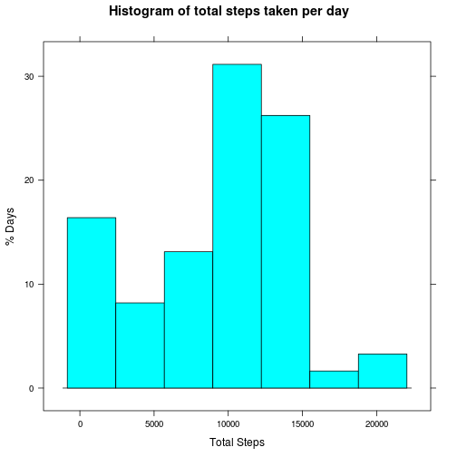
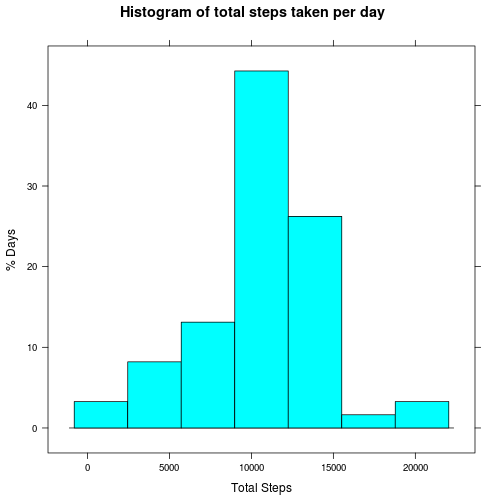
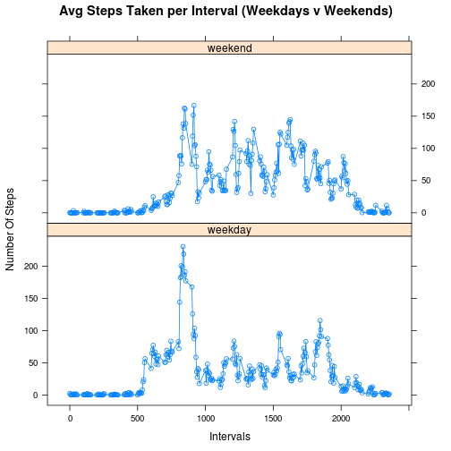

Reproducible Research - Project 1 
=================================

---
output:
  html_document:
    keep_md: yes
---


This document is an attempt at the first project in the Reproducible Research course. 
I first load libraries & check for files. I have broken down the project into 4 parts. 


###Global Settings:


```r
library(dplyr)
library(ggplot2)
library(lattice)
library(scales)

if(!file.exists("repdata%2Fdata%2Factivity.zip")) {
        dataURL <- "https://d396qusza40orc.cloudfront.net/repdata%2Fdata%2Factivity.zip"
        download.file(dataURL, dest="./repdata%2Fdata%2Factivity.zip", method="curl")
        unzip("./repdata%2Fdata%2Factivity.zip")
}
data <- read.csv("activity.csv", header=T, sep=",")
```

###Part 1:

What are the mean and median total number of steps: 

```r
total_steps <- data %>% group_by(date) %>% summarise(total = sum(steps,na.rm = T))
```
Mean:

```r
mean(total_steps$total)
```

```
## [1] 9354.23
```
Median:

```r
median(total_steps$total)
```

```
## [1] 10395
```
Plot a histogram of total number of steps per day:

```r
histogram(date ~ total, data=total_steps, 
          main="Histogram of total steps taken per day",
          xlab="Total Steps",
          ylab="% Days")
```

 

```r
# sexier version - not required
#ggplot(total_steps, aes(x=total), binwidth=x) + 
#        geom_histogram(fill="grey") +
#        geom_vline(xintercept = mean, color = "red", linetype = "dashed", size = 1) + 
#        geom_vline(xintercept = median, color = "blue", linetype = "dashed", size = 1) + 
#        labs(title="Histogram of total steps taken per day", x="Total Steps")
```


###Part 2:

A Time column is made by converting intervals into 4 digit numbers.
Then separate hours/mins with ':'.

```r
data$time <- sprintf("%04d",data$interval)
data$trime <- paste(substr(data$time, 1, 2),substr(data$time, 3, 4), sep=":")
```
I make a stack from the output of tapply: mean steps over time.

```r
mean_steps <- stack(tapply(data$steps, data$time, mean, na.rm=TRUE))
colnames(mean_steps) <- c("mean", "time")
```
Using this data, I make a time-series plot using the base package. 

```r
plot(mean_steps$time, mean_steps$mean, 
     main="Daily Avg Steps Per Time Interval",
     xlab = "Time Intervals",
     ylab = "Mean Steps")
```

 

Report the time of the max average step count: 08:35

```r
mean_steps[which.max(mean_steps$mean),]
```

```
##         mean time
## 104 206.1698 0835
```


###Part 3:

What is the count of rows containg NA data:

```r
nrow(subset(data, is.na(data))) 
```

```
## [1] 2304
```
Create a merged table with the mean values per time 
I then swap NA for the mean value on this time

```r
merged <- merge(data,mean_steps, by="time")
merged$steps[is.na(merged$steps)] <- merged$mean[is.na(merged$steps)]
```
The new dataset = original data but with NAs replaced & ordered by date, interval

```r
data_new <- merged[,1:4]
data_new <- data_new[order(data_new$date,data_new$interval),]
total_steps_new <- data_new %>% group_by(date) %>% summarise(total = sum(steps))
```
What is the mean in the new imputed data?

```r
mean(total_steps_new$total)
```

```
## [1] 10766.19
```
What is the median in the new imputed data?

```r
median(total_steps_new$total)
```

```
## [1] 10766.19
```
Replot the summed steps histogram from part 1 with new imputed data.

```r
histogram(date ~ total, data=total_steps_new, 
          main="Histogram of total steps taken per day",
          xlab="Total Steps",
          ylab="% Days")
```

 

```r
# sexier version - not required
#ggplot(total_steps_new, aes(x=total), binwidth=x) + 
#        geom_histogram(fill="grey") +
#        geom_vline(xintercept = mean, color = "red", linetype = "dashed", size = 1) + 
#        geom_vline(xintercept = median, color = "blue", linetype = "dashed", size = 1) + 
#        labs(title="Histogram of total steps taken per day", x="Total Steps")
```


###Part 4:

Add a day of the week column representing each date:

```r
data_week <- cbind(data_new,weekdays(as.Date(data_new$date)))
colnames(data_week) <- c("time","steps","date","interval","day")
```

Substitute weekdays and weekend appropriately - here I use gsub.

```r
data_week$day <- gsub("Saturday|Sunday", "weekend", data_week$day)
data_week$day <- gsub("(.*day)", "weekday", data_week$day)
```
Finally I make an average of steps per day per interval in a new dataframe.

```r
data_week_avg <- data_week %>% group_by(interval, day) %>% summarise(steps_avg = mean(steps))
```

Plot the new time series differentiating weekdays & weekends.

```r
xyplot(steps_avg ~ interval | day, data=data_week_avg, type="b",
       layout=c(1,2),
       main="Avg Steps Taken per Interval (Weekdays v Weekends)",
       xlab="Intervals",
       ylab="Number Of Steps"
       )
```

 

